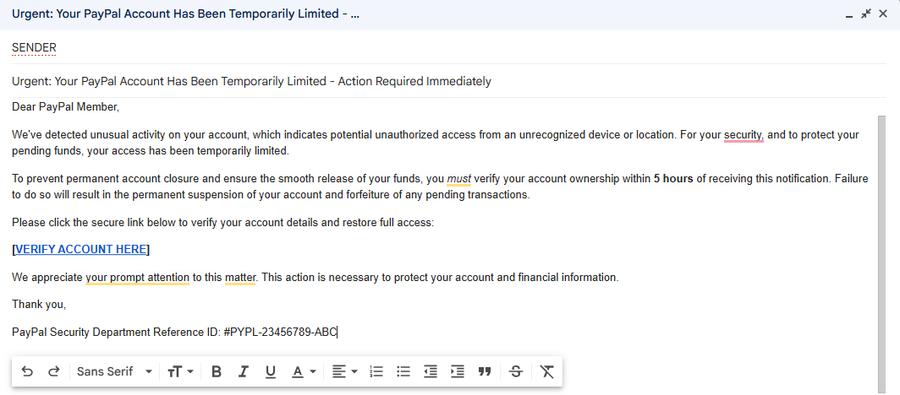
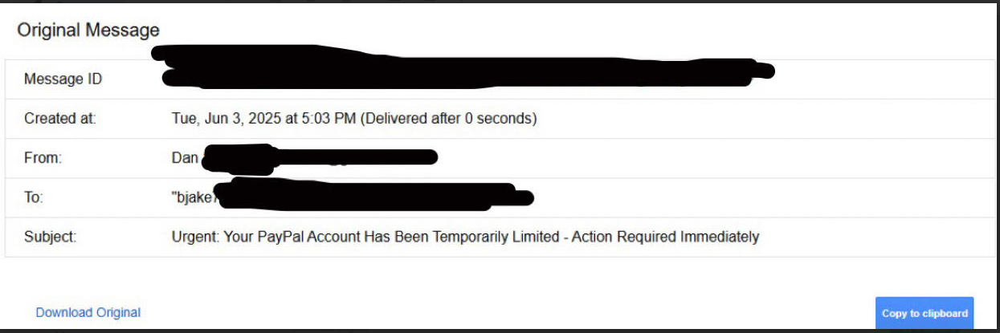

# simulated-phishing-analysis
Simulated phishing incident analysis: crafted a realistic phishing email, analyzed headers for IoCs, investigated link redirection to ISP, and detailed findings in an incident report. Enhanced skills in threat detection, email forensics, and incident response documentation, crucial for a SOC analyst role. #Cybersecurity #SOC #Phishing
# Simulated Phishing Incident Analysis Project

 This project demonstrates practical skills in **threat detection, email forensics, incident analysis, and structured incident reporting**, crucial for a Security Operations Center (SOC) Analyst role. It highlights my ability to dissect a common cyber threat and articulate a professional response.

## Project Goal

The primary objective of this project was to gain hands-on experience in the cybersecurity incident response lifecycle by:
* Ethically simulating a real-world phishing attack.
* Conducting a thorough analysis of the simulated incident, identifying key Indicators of Compromise (IoCs).
* Documenting the entire process, findings, and mitigation strategies in a formal incident report.

## Scenario Overview

A highly deceptive phishing email, meticulously crafted to impersonate an urgent account verification request from PayPal, was sent to a controlled test user account (`James`). The email strategically employed various social engineering tactics, including a strong sense of urgency and direct threats of account suspension and fund forfeiture, to compel immediate action.

The user, understandably concerned about potential loss of funds, clicked on the seemingly legitimate but ultimately malicious hyperlink embedded within the email. This action, designed to be deceptive, unexpectedly redirected them to their Internet Service Provider's (ISP) default error page, thus confirming the illegitimate nature of the link and the phishing attempt.

## Incident Analysis & Findings

My investigation into the simulated phishing incident involved a multi-faceted analysis, leveraging key cybersecurity principles to identify and understand the threat.

### 1. Email Content Review

The initial assessment of the phishing email's content revealed a sophisticated attempt at deception. Key observations include:

* **Urgent Subject Line:** The subject, "Urgent: Your PayPal Account Has Been Temporarily Limited - Action Required Immediately," was designed to trigger immediate concern and bypass critical thinking.
* **Social Engineering Tactics:** The email text skillfully used:
    * **Urgency:** An explicit deadline of "5 hours" and severe consequences ("permanent account closure," "forfeiture of pending transactions") to create pressure.
    * **Fear/Threat:** Warnings about "unauthorized access" and "account suspension."
    * **False Authority:** The inclusion of "PayPal Security Department" and a "Reference ID" aimed to lend a false sense of legitimacy.
* **Grammatical Precision:** Notably, the email displayed a high level of grammatical correctness, making it more convincing than typical, easily identifiable phishing attempts.
* **Absence of Personalization:** A subtle but critical red flag was the generic salutation "Dear PayPal Member" instead of a personalized greeting (like a full name), a common indicator of mass phishing campaigns.

*A screenshot of the simulated phishing email as received, highlighting the deceptive sender display name, urgent subject, and misleading hyperlink text. This image captures the initial user experience.*

### 2. Email Header Analysis

A crucial step involved a deeper dive into the email's raw headers to uncover its true origin and technical path. This analysis helps discern legitimate emails from fraudulent ones.

 *A redacted screenshot of the email's raw headers, emphasizing key fields such as 'Message ID', 'Created at', 'From:', 'To:', and 'Subject'. This view provides critical metadata for forensic analysis.*

Key observations from the header analysis included:

* **Sender Discrepancy:** While the display name was crafted to appear as a legitimate PayPal entity (e.g., "PayPal Security Center"), the actual sender's email address (`example@gmail.com`) clearly revealed it was not from a genuine PayPal domain. This mismatch is a classic phishing indicator.
* **Authentication Results:** Although SPF and DKIM passed (as the email was sent from a legitimate email provider like Gmail), the *content* and *context* of the email remained the primary indicators of compromise in this simulation. In a real-world scenario, failed authentication results (SPF, DKIM, DMARC) would be immediate, severe red flags.
* **Message Path:** Reviewing the `Received:` headers (not fully visible in the cropped screenshot but part of the full header analysis) allowed for tracing the email's journey through various mail servers, confirming standard routing but originating from an anomalous sender.

### 3. Hyperlink Investigation

The primary call to action in the email was to click a hyperlink, deceptively displayed as `[VERIFY ACCOUNT HERE]`.

* Upon inspection (e.g., hovering over the link), the true destination URL was revealed to be `http://verify-paypal-login-now.com/`, which is a non-existent domain. This disparity between the displayed text and the actual URL is a definitive sign of phishing.
* In the controlled simulation environment, clicking this link resulted in a redirection to my Internet Service Provider's (ISP) default error page, rather than a PayPal login page. This behavior unequivocally confirmed the link's malicious and fraudulent nature, as it did not lead to the expected legitimate service.

## Incident Response Report

For a comprehensive breakdown of the simulated incident, including the affected user's actions, all identified Indicators of Compromise (IoCs), detailed analysis, simulated containment steps, and the critical lessons learned, please refer to the full incident report:

[**View Full Incident Report (PDF)**](assets/phishing_incident_report.pdf)

## Simulated Containment & Mitigation Steps

Based on a real-world scenario, the following actions would be advised and/or taken by a SOC analyst to mitigate the impact and prevent recurrence:

1.  **Immediate User Education:** Reinforce phishing awareness with the affected user, emphasizing vigilance, the dangers of clicking suspicious links, and proper reporting procedures.
2.  **Email Deletion:** Advise the user to immediately delete the phishing email to prevent future accidental clicks.
3.  **Threat Intelligence Update:** Add the identified malicious URL (`http://verify-paypal-login-now.com/`) to internal threat intelligence feeds for blocking at network and endpoint levels.
4.  **Gateway/Endpoint Blocking:** Implement rules on email gateways and network firewalls to block emails originating from the observed sender domain and prevent access to the malicious URL.
5.  **Proactive Password Reset (if applicable):** If credentials were potentially compromised (even in simulation), advise an immediate password reset on the legitimate service.
6.  **MFA Enforcement:** Strongly recommend and assist users in enabling Multi-Factor Authentication (MFA) on all critical accounts to add an extra layer of security.

## Lessons Learned

This simulation provided invaluable practical experience and highlighted several key takeaways for improving cybersecurity posture and incident response:

1.  **The Human Factor Remains Critical:** Despite technical security measures, sophisticated social engineering remains a primary threat. Continuous user education and awareness training are paramount.
2.  **Always Verify, Never Trust:** Users should be trained to independently verify suspicious requests by directly navigating to official websites or using trusted contact information, rather than clicking embedded links.
3.  **Email Header Analysis is Key:** Understanding how to analyze email headers is crucial for discerning legitimate emails from phishing attempts, particularly for analyzing `From:`, `Received:`, and `Authentication-Results` headers for anomalies.
4.  **Importance of Layered Security:** The user's post-incident proactive actions (e.g., directly accessing the official site, password change, MFA setup) demonstrate the effectiveness of layered security controls and proactive user behavior in mitigating potential damage.

## Conclusion

This project underscored the importance of continuous vigilance and analytical rigor in cybersecurity. Understanding both the technical intricacies and the psychological manipulation inherent in phishing attacks is vital for effective security operations and incident response.

---

**Final Implementation Steps:**

1.  **Go to your GitHub Repository:** `https://github.com/jaybro6000/simulated-phishing-analysis`
2.  **Click on `README.md`** in your file list.
3.  **Click the pencil icon** (✏️) on the right side, above the `README.md` content, to enter edit mode.
4.  **Delete all existing content** in the `README.md` editor.
5.  **Copy and paste this entire Markdown text** provided above into the editor.
6.  **Verify Filenames One Last Time (Crucial!):**
    * Confirm that the filenames you have uploaded to your `assets` folder are *exactly* these (including capitalization and extensions):
        * `phishing_email_screenshot.png`
        * `email_redacted_screenshot.png` (This is the one we just confirmed!)
        * `phishing_incident_report.pdf`
    * If any names differ, update them in the `README.md` text *before* committing.
7.  **Commit Changes:** Scroll down, add a clear commit message (e.g., "Final README with all assets and updated image path"), and click the green **"Commit changes"** button.

Once you commit this, your project should be perfectly displayed on GitHub!
