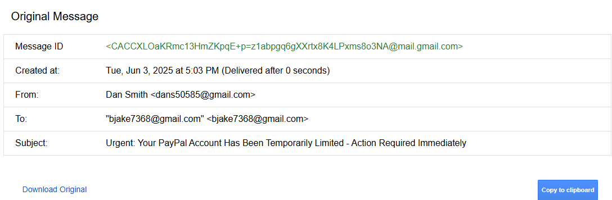

# simulated-phishing-analysis
Simulated phishing incident analysis: crafted a realistic phishing email, analyzed headers for IoCs, investigated link redirection to ISP, and detailed findings in an incident report. Enhanced skills in threat detection, email forensics, and incident response documentation, crucial for a SOC analyst role. #Cybersecurity #SOC #Phishing
# Simulated Phishing Incident Analysis Project

 This project demonstrates practical skills in **threat detection, email forensics, incident analysis, and structured incident reporting**, crucial for a Security Operations Center (SOC) Analyst role.

## Project Goal

To ethically simulate a common phishing attack, analyze the "incident" from a SOC analyst's perspective, identify key Indicators of Compromise (IoCs), and document the process in a formal incident report. This hands-on experience provides insight into the lifecycle of a social engineering attack.

## Scenario Overview

A highly deceptive phishing email, masquerading as an urgent PayPal account verification, was sent to a test user account. The email employed various social engineering tactics to induce immediate action, leading the user to click on a seemingly legitimate but ultimately malicious hyperlink.

## Incident Analysis & Findings

### 1. Email Content Review

The phishing email was crafted with a high degree of sophistication, featuring:
* **Urgent Subject Line:** "Urgent: Your PayPal Account Has Been Temporarily Limited - Action Required Immediately"
* **Social Engineering Tactics:** Explicit deadlines ("within 5 hours"), threats of account closure and fund forfeiture, and a deceptive sense of authority ("PayPal Security Department," "Reference ID").
* **Grammar:** Notably few grammatical errors, making it more convincing.

*A screenshot of the simulated phishing email as received, highlighting the deceptive sender display name, urgent subject, and misleading hyperlink text.*

### 2. Email Header Analysis

A critical step involved analyzing the email's raw headers to uncover its true origin and authenticity. Key observations included:

* **Sender Discrepancy:** While the display name was "PayPal Security Center," the actual sender's email address (`example@gmail.com`) immediately revealed it was not from a legitimate PayPal domain.
* **Authentication Results:** Although SPF and DKIM passed (due to sending from a legitimate email provider like Gmail), the *content* and *context* of the email were the primary indicators of compromise, not the authentication results in this simulation. In a real-world scenario, failed authentication results would be a critical red flag.
* **Message Path:** Reviewing the `Received:` headers confirmed the email's journey through standard mail servers, but the originating domain remained suspicious.

*A redacted screenshot of the email's raw headers, emphasizing the 'From:' field (actual sender vs. display name) and relevant 'Received:' headers.*

### 3. Hyperlink Investigation

The call to action involved clicking a hyperlink displayed as `[VERIFY ACCOUNT HERE (hyperlink to your harmless, fake URL)]`.
* Upon hovering, the true destination URL was revealed as `http://verify-paypal-login-now.com/`, a non-existent domain.
* Clicking this link (in the controlled simulation environment) resulted in a redirection to my Internet Service Provider's (ISP's) default error page. This behavior unequivocally confirmed the link's malicious and fraudulent nature, as it did not lead to the expected legitimate service.

## Incident Response Report

For a comprehensive breakdown of the incident, including the affected user's actions, all identified Indicators of Compromise (IoCs), detailed analysis, simulated containment steps, and lessons learned, please refer to the full incident report:

[**View Full Incident Report (PDF)**](phishing_incident_report.pdf)

## Skills Demonstrated

This project provided hands-on experience and strengthened the following skills:

* **Threat Detection & Analysis (Phishing & Social Engineering)**
* **Email Header Analysis & Forensics**
* **Indicator of Compromise (IoC) Identification**
* **Incident Reporting & Documentation (following structured formats)**
* **Basic Incident Response Planning**
* **Vulnerability Awareness (Human Factor)**
* **Security Best Practices Advocacy**

## Conclusion

This simulation reinforced the critical importance of continuous vigilance and user education in cybersecurity. Understanding both the technical and social engineering aspects of phishing attacks is vital for effective security operations.
